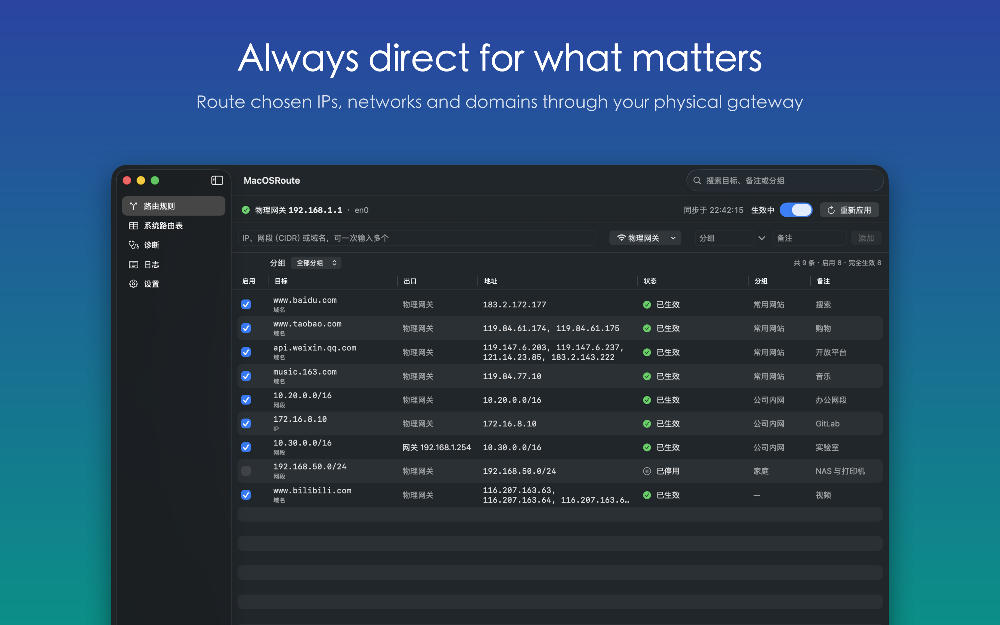

# MacOSRoute

Keep chosen IPs, networks and domains routed through your physical gateway on macOS. Routes re-apply automatically when you switch Wi-Fi, plug in Ethernet, or wake from sleep.

English | [简体中文](README.zh-CN.md)



## Install

1. Download the latest `MacOSRoute-<version>.dmg` from [Releases](https://github.com/castorworks/MacOSRoute/releases/latest). The app is signed with Developer ID and notarized by Apple.
2. Drag MacOSRoute to Applications and open it.
3. Click **Install Helper** and enter your administrator password once.

Requires macOS 14 or later, on Apple silicon or Intel.

## Features

- **Rules:** IPs, CIDR ranges and domains, with a per-rule exit (physical gateway, a specific interface, or a specific gateway). Rules support groups and priority, and you can pause them all or import and export them.
- **Automatic upkeep:** a background service watches network and routing table changes, and repairs routes that go stale or that other software removes.
- **DNS:** lookups go over the physical interface, proxy Fake-IP answers are ignored, and recently seen CDN addresses stay routed for a while.
- **Route table:** a live view of the kernel IPv4 routing table, with stale static route detection and cleanup.
- **Diagnostics:** compare DNS answers, see which interface and gateway each address actually uses, and test TCP connectivity.
- **Menu bar:** quick controls, launch at login, and an activity log.

## How It Works

The app manages rules. A root launch daemon (`com.hyperits.app.MacOSRoute.helper`) applies them over XPC, and it only accepts connections from the app signed by the same team.

On every sync, the helper compares your rules with the kernel routing table and fixes the differences. If the network is temporarily down, it keeps existing routes. When you remove a rule, the address goes back to how it was before the rule existed.

Rules and state live in `/Library/Application Support/MacOSRoute/`. The log is `/Library/Logs/MacOSRoute/helper.log`.

## Build

Open `MacOSRoute.xcodeproj` in Xcode 16 or later and run the `MacOSRoute` scheme.

```bash
xcodebuild -project MacOSRoute.xcodeproj -scheme MacOSRoute test   # unit tests
./scripts/release.sh       # archive, notarize and package a DMG
./scripts/screenshots.sh   # regenerate screenshots with demo data
./scripts/export-icons.sh  # export PNGs from the Icon Composer icons
```

Increase `RouteConstants.helperVersion` whenever the helper or its XPC protocol changes.

## Limitations

- Only IPv4 routes are managed.
- Domain rules route the IP addresses a domain resolves to. They can't match individual subdomains or traffic by SNI.
- The app needs a privileged helper, so it can't be distributed through the Mac App Store.

## Privacy

MacOSRoute has no analytics and no servers. See the [Privacy Policy](https://github.com/castorworks/Privacy/blob/main/MacOSRoute/privacy.md).

## License

[MIT](LICENSE) © 2026 Chongqing Hyperits Network Technology Co., Ltd.
