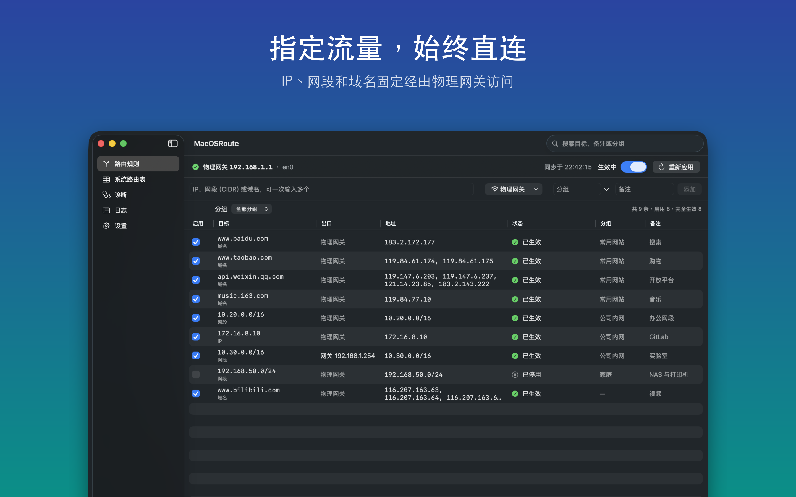

# MacOSRoute

让指定的 IP、网段和域名始终经由 Mac 的物理网关访问。切换 Wi-Fi、插拔网线或睡眠唤醒后，路由会自动重新应用。

[English](README.md) | 简体中文



## 安装

1. 从 [Releases](https://github.com/castorworks/MacOSRoute/releases/latest) 下载最新的 `MacOSRoute-<版本>.dmg`（已签名并通过 Apple 公证）
2. 把 MacOSRoute 拖到“应用程序”文件夹并打开
3. 点击“安装后台服务”，输入一次管理员密码

系统要求：macOS 14 或更高版本（Apple 芯片或 Intel）。

## 功能

- **规则**：支持 IP、网段和域名；每条规则可选出口（物理网关、指定网卡或指定网关）；支持分组、优先级、全局暂停和导入导出
- **自动维护**：后台服务监听网络变化和路由表变化，自动修正失效的路由，以及被其他软件删除的路由
- **DNS**：经由物理网卡解析域名，忽略代理的 Fake-IP；CDN 近期用过的旧地址会保留一段时间
- **路由表**：实时查看内核 IPv4 路由表，检测并清理失效的静态路由
- **诊断**：对比 DNS 解析结果，查看每个地址实际使用的网卡和网关，并测试 TCP 连通性
- **菜单栏**：快捷操作、登录时启动、运行日志

## 工作原理

App 负责管理规则，以 root 身份运行的后台服务（`com.hyperits.app.MacOSRoute.helper`）通过 XPC 执行规则，只接受同一开发团队签名的 App 连接。每次同步时，后台服务都会把规则与内核路由表逐条比对并修正差异。网络暂时断开时保留现有路由；删除规则后，对应地址恢复到添加规则之前的状态。

规则和运行状态保存在 `/Library/Application Support/MacOSRoute/`，日志在 `/Library/Logs/MacOSRoute/helper.log`。

## 构建

用 Xcode 16 或更高版本打开 `MacOSRoute.xcodeproj`，运行 `MacOSRoute` Scheme。

```bash
xcodebuild -project MacOSRoute.xcodeproj -scheme MacOSRoute test   # 单元测试
./scripts/release.sh       # 归档、公证并打包 DMG
./scripts/screenshots.sh   # 用演示数据重新生成截图
./scripts/export-icons.sh  # 从 Icon Composer 图标导出 PNG
```

修改后台服务或 XPC 协议时，请递增 `RouteConstants.helperVersion`。

## 限制

- 仅管理 IPv4 路由
- 域名规则作用于域名解析出的 IP，无法单独匹配某个子域名，也无法按 SNI 匹配流量
- 需要特权后台服务，因此无法通过 Mac App Store 分发

## 隐私

MacOSRoute 不收集统计数据，也没有服务器。详见[隐私政策](https://github.com/castorworks/Privacy/blob/main/MacOSRoute/privacy-zh.md)。

## 许可证

[MIT](LICENSE) © 2026 Chongqing Hyperits Network Technology Co., Ltd.
